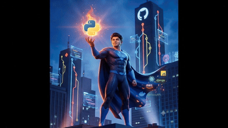
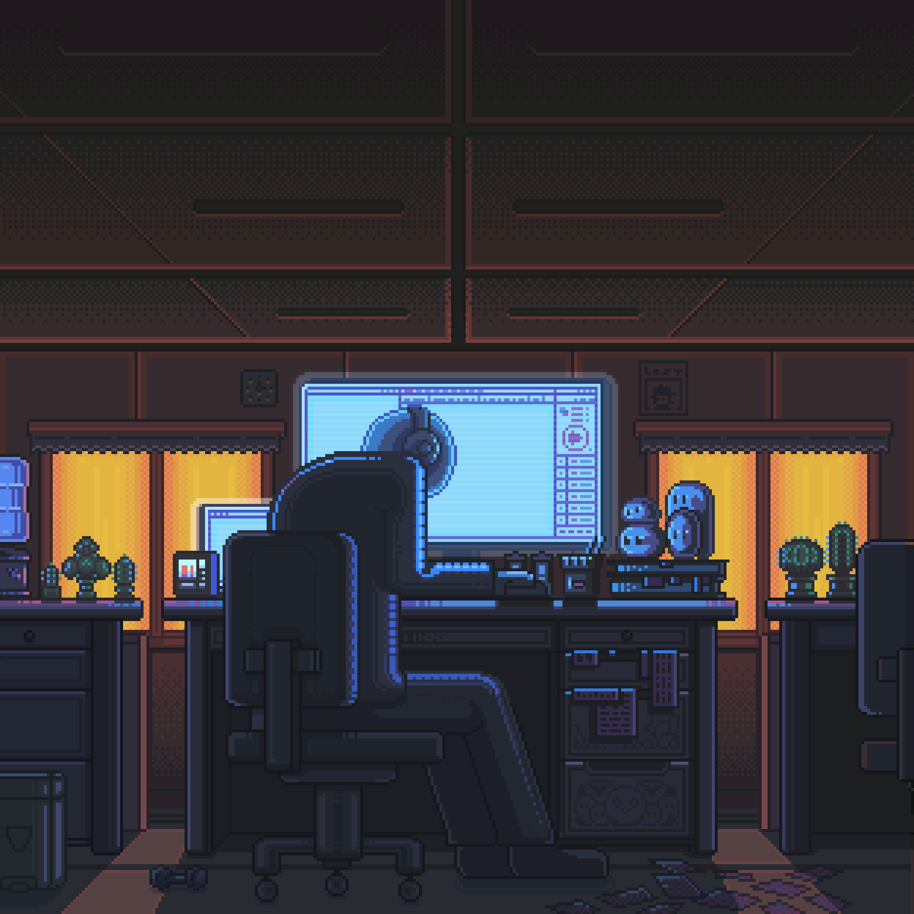

<!-- =======================================================
                     DEV PATEL GITHUB PROFILE
======================================================= -->

<div align="center">



# Hi there, I'm Dev Patel 👋

### 🚀 Full Stack Developer • Backend Enthusiast • AI Explorer


<p>
Building scalable web applications, APIs and AI-powered solutions while continuously exploring modern software engineering.
</p>

<p>
<a href="https://github.com/devpatel-1">

</a>

<a href="https://linkedin.com/in/dev-patel-b54090325">

</a>

<a href="https://instagram.com/dev_patel3746">

</a>

<a href="https://portfolio-one-liard-79.vercel.app">

</a>

<a href="mailto:devapatel09092006@gmail.com">

</a>

</p>

</div>

---

# 👨‍💻 About Me



🚀 Passionate about building real-world software that solves meaningful problems.

🎓 Computer Engineering student focused on backend development, scalable systems, and artificial intelligence.

💡 I enjoy turning ideas into production-ready applications while continuously improving my development skills.

---

## 🚀 Currently Working On

- 🌐 Full Stack Web Applications
- 🤖 AI-powered applications
- 💬 Real-time Chat Systems
- ⚡ REST APIs with Django & FastAPI
- 🔥 Personal Projects & Open Source

---

## 🌱 Currently Learning

- 🧠 Large Language Models (LLMs)
- 📝 Prompt Engineering
- 🐳 Docker
- ☁️ AWS Cloud
- 🏗️ System Design
- 🔍 Vector Databases
- ⚡ Redis
- 🐘 PostgreSQL

---

## 💬 Ask Me About

```text
🐍 Python
⚡ FastAPI
🎯 Django
⚛️ React
🟢 Node.js
🍃 MongoDB
🔥 Firebase
💻 JavaScript
🌐 REST APIs
```

---

## ⚡ Fun Fact

> **I learn fastest by building real-world projects instead of only watching tutorials.**

---

# 🛠️ Tech Stack

## 🚀 Backend

<p>

</p>

---

## 🎨 Frontend

<p>

</p>

---

## ☁️ Cloud & DevOps

<p>

</p>

---

## 🗄️ Databases

<p>

</p>

<p>


</p>

---

## 🤖 AI / Machine Learning

<p>

</p>


---

## 🧰 Tools

<p>

</p>

---

<div align="center">

### 💡 *"Building today, learning forever, improving every single day."*

</div>

---
<!-- =======================================================
                    FEATURED PROJECTS
======================================================= -->

# 🚀 Featured Projects

<div align="center">

| Project | Description | Tech |
|:--------:|:-----------|:-----|
| 💬 **GatherIn** | Real-time chat application with authentication, responsive UI and modern messaging experience. | React • Firebase • JavaScript |
| 🌦️ **Weather App** | Beautiful weather forecasting application with real-time API integration. | JavaScript • HTML • CSS |
| ✅ **Task Manager API** | Secure RESTful API with JWT authentication, CRUD operations and MongoDB integration. | Node.js • Express • MongoDB |
| 🎯 **Portfolio Website** | Personal portfolio showcasing projects, skills and achievements. | React • Vercel |
| 🤖 **AI Experiments** | Exploring LLMs, Prompt Engineering and AI-powered applications. | Python • OpenAI |

</div>

---

---

# 📈 Contribution Graph

<div align="center">


</div>

---

# 🐍 Contribution Snake

<div align="center">


</div>

---

# 🌐 Connect With Me

<div align="center">

<a href="https://github.com/devpatel-1">

</a>

<a href="https://linkedin.com/in/dev-patel-b54090325">

</a>

<a href="https://instagram.com/dev_patel3746">

</a>

<a href="https://portfolio-one-liard-79.vercel.app">

</a>

<a href="mailto:devapatel09092006@gmail.com">

</a>

</div>

---

# 👀 Profile Views

<div align="center">


</div>

---

# 💭 Random Dev Quote

<div align="center">


</div>

---

<div align="center">

## ⭐ Thanks for visiting my profile!

### 🚀 Building • Learning • Innovating

*"Every great developer you know once struggled with the same concepts you're learning today. Keep building."*


</div>
